### <code>anshdeep@github ~ $ ./contributions.sh</code>

  

### <code>anshdeep@github ~ $ whoami</code>

<table>
  <tr>
    <td valign="top" width="43%">
      
    </td>
    <td valign="top" width="57%">
      
    </td>
  </tr>
</table>

 

<strong>Developer · Data Science · Android · Web · AI · Creative</strong>

  

<a href="https://anshdeepofficial1.vercel.app/">Portfolio</a> ·
<a href="https://anshdeepofficial1.vercel.app/coding/">Coding</a> ·
<a href="https://anshdeepofficial1.vercel.app/editing/">Editing</a> ·
<a href="https://www.linkedin.com/in/anshdeepofficial1/">LinkedIn</a> ·
<a href="https://www.instagram.com/anshdeepofficial1/">Instagram</a>

 

### <code>anshdeep@github ~ $ ls ./featured</code>

| Project | What I’m building |
| --- | --- |
| **[AniDash](https://github.com/anshdeepofficial1/AniDash)** | A multi-platform anime experience with discovery, tracking and an integrated AI layer. |
| **[VYBE](https://github.com/anshdeepofficial1/VYBE)** | A polished Android music player focused on a smooth, modern listening experience. |
| **[Copy Cloud](https://github.com/anshdeepofficial1/Copy-Cloud)** | A fast web utility built around simple cross-device text workflows. |
| **[Portfolio](https://github.com/anshdeepofficial1/Portfolio)** | My coding + editing portfolio, built as a clean public showcase of my work. |

 

### <code>anshdeep@github ~ $ cat profile.txt</code>

I build practical products across **mobile, web, AI and creative tooling**, with a focus on polished UI, useful automation and production-ready experiences. I’m currently pursuing **BCA (Hons.) with Research in Data Science** and continuously shipping projects that combine engineering with design.

Contribution data is generated from GitHub’s public contribution calendar and refreshed automatically by GitHub Actions. No personal access token or hosted profile-stats service is used.

<!-- profile-art:v1 -->