# Anshdeep Singh

<code>developer@github:~$ building mobile · web · AI · creative products</code>

  

<a href="https://anshdeepofficial1.vercel.app/">Portfolio</a> ·
<a href="https://anshdeepofficial1.vercel.app/coding/">Coding</a> ·
<a href="https://anshdeepofficial1.vercel.app/editing/">Editing</a> ·
<a href="https://www.linkedin.com/in/anshdeepofficial1/">LinkedIn</a> ·
<a href="https://www.instagram.com/anshdeepofficial1/">Instagram</a>

  

### <code>anshdeep@github ~ $ ./contributions.sh</code>

  

### <code>anshdeep@github ~ $ whoami --dashboard</code>

<table>
  <tr>
    <td valign="top" width="43%">
      
    </td>
    <td valign="top" width="57%">
      
    </td>
  </tr>
</table>

 

### <code>anshdeep@github ~ $ ./workspace --overview</code>

 

### <code>anshdeep@github ~ $ ls ./featured</code>

| Project | Build |
| --- | --- |
| **[AniDash](https://github.com/anshdeepofficial1/AniDash)** | Multi-platform anime experience with discovery, tracking and an integrated AI layer. |
| **[VYBE](https://github.com/anshdeepofficial1/VYBE)** | Modern Android music player focused on a polished, smooth listening experience. |
| **[Copy Cloud](https://github.com/anshdeepofficial1/Copy-Cloud)** | Fast cross-device text and file transfer utility with a clean web experience. |
| **[Portfolio](https://github.com/anshdeepofficial1/Portfolio)** | Coding + editing portfolio and public showcase of my work. |

### <code>anshdeep@github ~ $ cat profile.txt</code>

I build practical products across **Android, web, AI and creative tooling** with a strong focus on clean UI, useful automation and production-ready experiences. I’m pursuing **BCA (Hons.) with Research in Data Science** and continuously shipping projects that combine engineering with design.

> **Profile dashboard:** contribution data refreshes daily through GitHub Actions. The contribution total and calendar are pulled from GitHub itself, with the built-in Actions token used when available — no personal access token or hosted stats service.

Made as a self-contained terminal-style GitHub profile · animated SVG · live contribution data

<!-- profile-art:v3:dashboard -->