# Anshdeep Singh

<code>developer@github:~$ building useful products with code, design and automation</code>

  

<a href="https://anshdeepofficial1.vercel.app/">Portfolio</a> ·
<a href="https://anshdeepofficial1.vercel.app/coding/">Coding</a> ·
<a href="https://anshdeepofficial1.vercel.app/editing/">Editing</a> ·
<a href="https://www.linkedin.com/in/anshdeepofficial1/">LinkedIn</a> ·
<a href="https://www.instagram.com/anshdeepofficial1/">Instagram</a>

  

### <code>anshdeep@github ~ $ ./contributions.sh</code>

  

### <code>anshdeep@github ~ $ whoami --dashboard</code>

<table>
  <tr>
    <td valign="top" width="43%">
      
    </td>
    <td valign="top" width="57%">
      
    </td>
  </tr>
</table>

 

### <code>anshdeep@github ~ $ projects --live</code>

<a href="https://github.com/anshdeepofficial1/AniDash">AniDash</a> ·
<a href="https://github.com/anshdeepofficial1/VYBE">VYBE</a> ·
<a href="https://github.com/anshdeepofficial1/Copy-Cloud">Copy Cloud</a>

  

### <code>anshdeep@github ~ $ git log --recent --projects</code>

  

### <code>anshdeep@github ~ $ ./toolchain --profile</code>

 

### <code>anshdeep@github ~ $ cat profile.txt</code>

I like turning rough ideas into **polished, shippable software**: define the flow, make it reliable, automate repetitive work, then keep refining the details. I’m pursuing **BCA (Hons.) with Research in Data Science** while building and maintaining real products across different platforms.

The visuals above are self-contained SVGs committed to this repository. Contribution data and project activity refresh automatically through GitHub Actions, so the profile stays current without relying on hosted profile-stat widgets.

 

<code>anshdeep@github:~$ <b>_</b></code>

  

terminal profile · live repository data · animated SVG · automated refresh

<!-- profile-art:v4:live-workspace -->